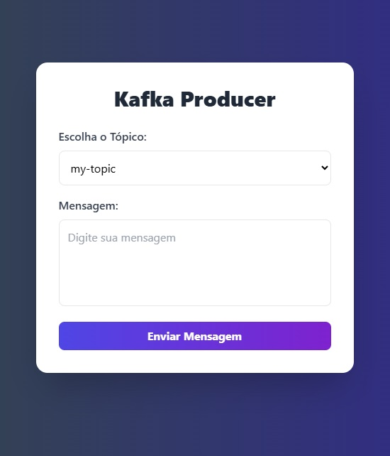

# **API Documentation - Kafka GZIP Consumer**

## **Project Description**
This API is designed to consume messages from Apache Kafka, save them as **GZIP** files on disk, and persist metadata in a **PostgreSQL** database. The application uses the **Spring Boot** framework with Java 17 and includes an exposed route for receiving messages, allowing direct production to the Kafka topic.

---

## **Technologies Used**

- **Java 17**
- **Spring Boot**
- **Apache Kafka** (Messaging Service)
- **PostgreSQL** (Relational Database)
- **Docker** (For local Kafka execution)
- **GZIP** (Message compression into files)

---

## **Prerequisites**

1. **Java 17** installed
2. **Docker** installed and configured
3. Configured **PostgreSQL** server
4. Running **Kafka** service (via Docker)

---

## **Project Configuration**

### **application.properties**

```properties
# Application Configurations
spring.application.name=kafkagzipconsumer 

# Kafka Configurations
spring.kafka.bootstrap-servers=localhost:9092
spring.kafka.consumer.group-id=kafka-gzip-group
spring.kafka.consumer.auto-offset-reset=earliest
spring.kafka.consumer.key-deserializer=org.apache.kafka.common.serialization.StringDeserializer
spring.kafka.consumer.value-deserializer=org.apache.kafka.common.serialization.StringDeserializer
kafka.topic=my-topic

# GZIP Configurations
gzip.output-dir=./output
gzip.max-messages=5
gzip.time-interval=10000

# PostgreSQL Configurations
spring.datasource.url=jdbc:postgresql://localhost:5432/kafkagzip?ssl=false
spring.datasource.username=postgres
spring.datasource.password=postgres
spring.jpa.hibernate.ddl-auto=update
spring.jpa.properties.hibernate.dialect=org.hibernate.dialect.PostgreSQLDialect
spring.jpa.show-sql=true
```

---

## **How to Run the Project**

1. **Start Kafka using Docker**:
   ```bash
   docker-compose up -d
   ```

2. **Produce Messages to Kafka**:
   Use the following command to produce messages directly to the **my-topic** topic:
   ```bash
   docker exec -it broker kafka-console-producer.sh --broker-list localhost:9092 --topic my-topic
   ```

   ### OR

   ### Use the **Frontend (Message Production Interface)**
   
   👉🏾 **[Repository](https://github.com/jrrodrigo421/kafka-producer-test)**&nbsp;&nbsp;
   
   🛜 **[Online Page](https://kafkaproducertest.vercel.app)**
   
   
   
   
   
   1. **Clone the Frontend Repository**:
      ```bash
      git clone https://github.com/jrrodrigo421/kafka-producer-test.git
      cd kafka-producer-ui
      ```

   2. **Install Dependencies**:
      ```bash
      npm install
      ```

   3. **Run the Interface**:
      ```bash
      npm start
      ```
      - The interface will be available at `http://localhost:3000`.

3. **Run the API**:
   Start the Spring Boot project using:
   ```bash
   mvn spring-boot:run
   ```

---

## **API Endpoints**

### **1. Message Production Endpoint**

- **Endpoint**: `POST /api/kafka/send`
- **Description**: Sends messages directly to the Kafka **my-topic** topic.
- **Parameters**:
   - **Body**: Plain text (String)
- **Request Example**:
   ```http
   POST http://localhost:8080/api/kafka/send
   Content-Type: text/plain

   This is a test message for Kafka!
   ```

---

## **Useful Commands**

1. **List Kafka Topics**:
   ```bash
   docker exec -it broker kafka-topics.sh --bootstrap-server localhost:9092 --list
   ```

2. **Consume Messages**:
   ```bash
   docker exec -it broker kafka-console-consumer.sh --bootstrap-server localhost:9092 --topic my-topic --from-beginning
   ```

---

## **Conclusion**
This documentation explains how to configure, run, and interact with the Kafka GZIP Consumer API, providing a robust and efficient flow for consuming and persisting Kafka messages.

🚀
